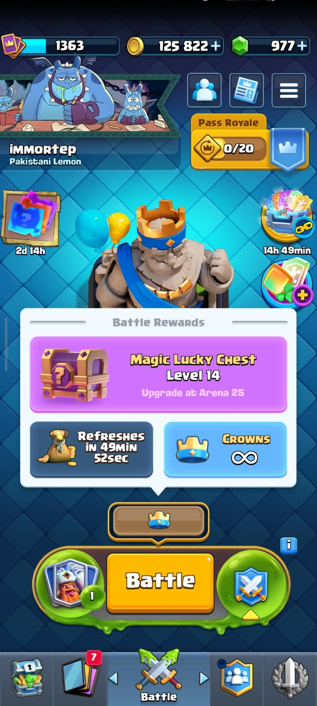
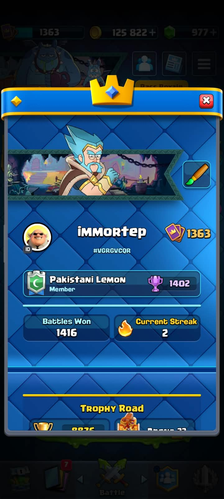
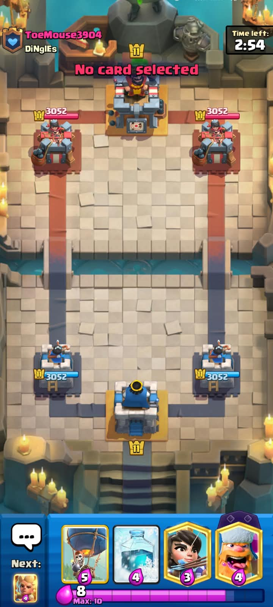
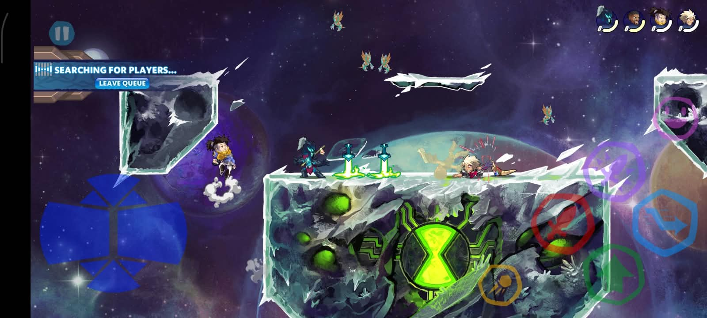
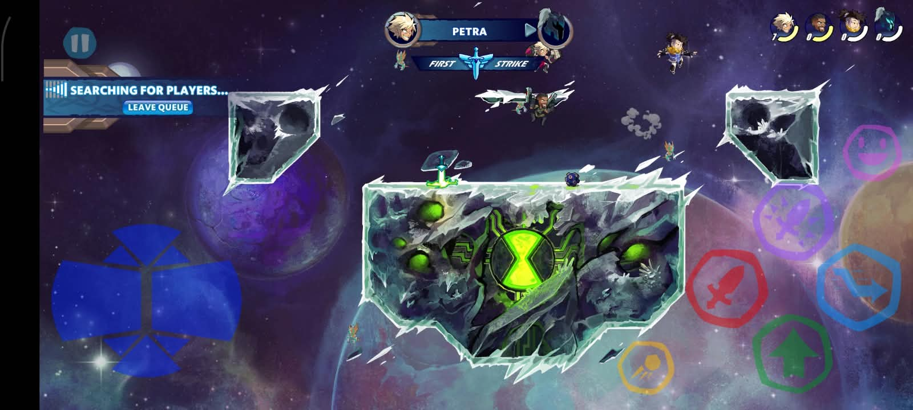
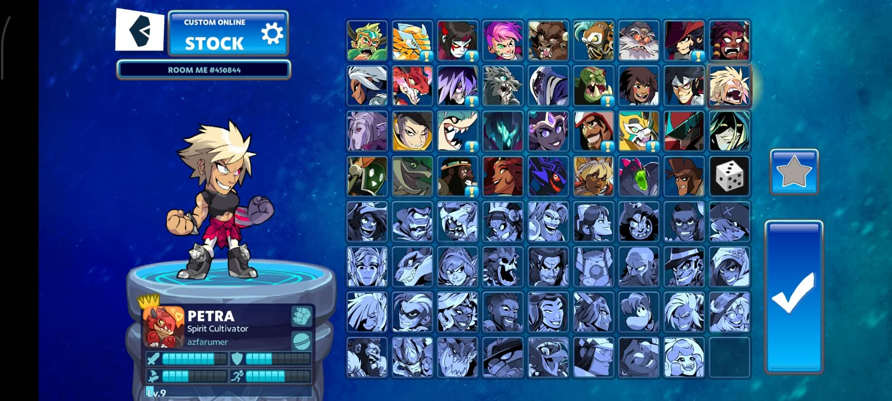
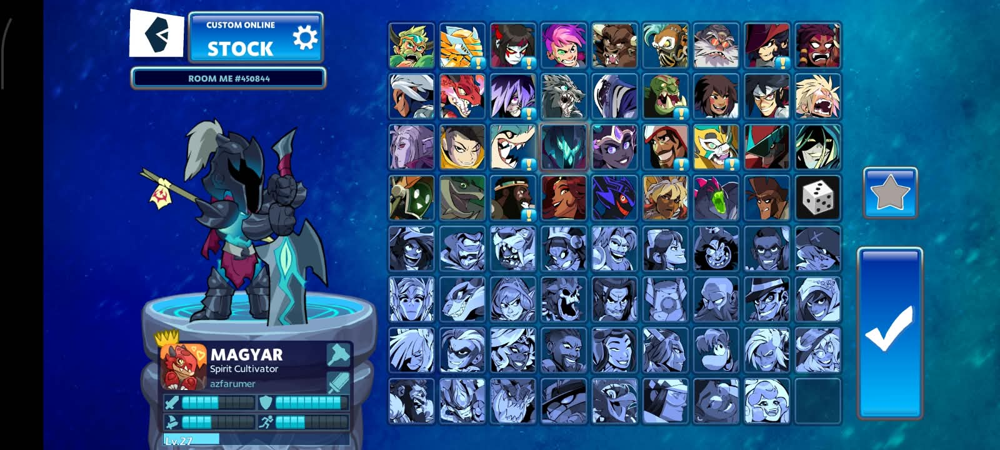
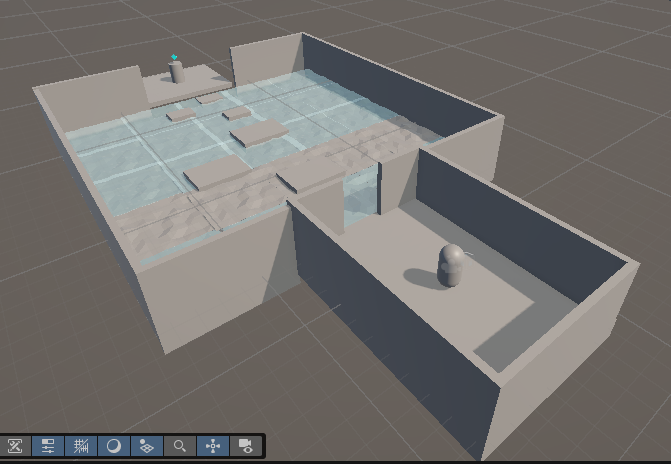
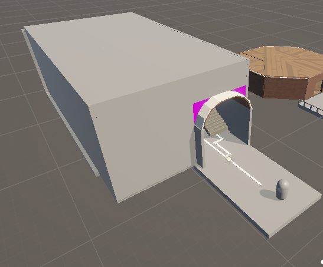
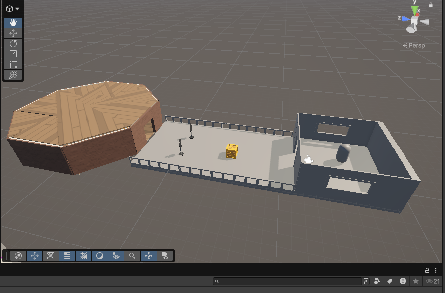

# CS464 Assignment 01 · Hafiz Azfar Umar Sheikh · BSSE23064

## Game 1 · Clash Royale

- **Store link:** https://play.google.com/store/apps/details?id=com.supercell.clashroyale
- **Genre:** Real-Time Strategy / Tower Rush / Card Battle
- **I played:** Cumulative time, approx 1 year, reached 8876 trophies on the Trophy road
- **Video (optional):** [YouTube (unlisted) or Google Drive link]

1. [M4] · it shows the daily rewards, currently on timeout as they have already been claimed for the day.
2. [] · Screenshot of my profile, showing trophies
3. [M1, M2] · It shows the example of a match

| #   | Mechanic                                                                                                                                                                                                                                                | Dynamic                                                                                                                                                                                                                                                                                 | Aesthetic                                                                                                                                                | Bartle type                                                                                                                       |
| --- | ------------------------------------------------------------------------------------------------------------------------------------------------------------------------------------------------------------------------------------------------------- | --------------------------------------------------------------------------------------------------------------------------------------------------------------------------------------------------------------------------------------------------------------------------------------- | -------------------------------------------------------------------------------------------------------------------------------------------------------- | --------------------------------------------------------------------------------------------------------------------------------- |
| M1  | Elixir regenerates passively at 1 unit every 2.8 seconds, capped at a maximum pool of 10 units.                                                                                                                                                         | Players refrain from playing heavy elixir cards unless they have a card advantage or an elixir advantage on the opponent, otherwise they may get overwhelmed by the opponent.                                                                                                           | Challenge: testing real-time resource management and rapid decision-making under intense conditions.                                                     | Achiever: optimizing elixir efficiency and get positive elixir trades to maximize your combat efficiency.                         |
| M2  | Battles take place on a two-lane arena for 3 minutes; destroying an enemy Princess Tower yields 1 Crown, while destroying the central King Tower awards an automatic 3-Crown victory, Central King Tower has more health than princess towers.          | Attackers often settle for one princess towers because getting 1 princess tower and successfully defending counts as a victory, some players design their decks so that they are not meant to go for all 3 towers.                                                                      | Challenge: a tactical obstacle course where a single defensive misstep costs an entire tower.                                                            | Killer: asserting direct tactical dominance and crushing an opposing player's defenses.                                           |
| M3  | Winning a 1v1 ladder battle awards approximately 30 Trophies, while losing deducts approximately 30 Trophies, dictating Arena tier promotions and leaderboard placement.                                                                                | Players experience competitive anxiety and tilt during loss streaks, frequently tweaking card selections to adapt to the local trophy bracket's meta.                                                                                                                                   | Challenge: a ruthless competitive ladder where progression directly reflects skill and composure against real humans.                                    | Killer: climbing the leaderboard at the direct expense of defeated rivals whose trophies are lost.                                |
| M4  | Match victories award chests, 4 chests per day, each chest can be from 1 to 5 stars, higher stars mean better loot.                                                                                                                                     | Players log into the game once and finish their dailies, earn their chests and log off for the day.                                                                                                                                                                                     | Submission: an undemanding, habitual check-in loop that integrates seamlessly into daily routines.                                                       | Achiever: maintaining continuous passive progression toward account collection milestones.                                        |
| M5  | Upgrading cards from level 1 to level 15 requires spending gold and collecting duplicate cards, increasing that card's hitpoints and damage by roughly 10% per level.                                                                                   | Players hoard gold and request specific duplicates from clanmates daily, hyper-focusing resources onto maxing a single 8-card deck before diversifying.                                                                                                                                 | Submission: long-term, incremental progression loops that reward regular grind over weeks and months.                                                    | Achiever: fulfilling tangible collection metrics and maximizing numerical stat advantages.                                        |
| M6  | Players assemble a deck limited to exactly 8 unique cards from their collection, with the game calculating and displaying the average elixir cost before queuing.                                                                                       | Players theorycraft deck archetypes (e.g., fast cycle, beatdown, spell bait) to find synergistic offensive-defensive combos that counter dominant meta decks.                                                                                                                           | Expression: designing a bespoke combat identity and strategic playstyle through tailored deck composition.                                               | Explorer: testing card interactions, pathing rules, and spell synergies to uncover hidden system behaviors.                       |
| M7  | Matchmaking system allows any level of player to be in any arena, so it is possible for skilled players whose King level is low to still gain trophies and climb up the Trophy Road and vice versa for higher level King players to be in lower arenas. | Players with low King level eventually hit a plateau as they climb up, because the higher they go on average their opponents start to become more overleveled than them and underleveled troops cannot fairly compete and have to level up their cards and King level to climb further. | Challenge: game as an obstacle course where overcoming severe level disadvantages tests raw mechanical skill and composure against uneven odds.[cite: 2] | Achiever: acting on the world by climbing ranked milestones and pushing account progression to break through level caps.[cite: 2] |

**Aesthetic profile:** Challenge and Submission lead: Challenge drives the real-time competitive duels and ranked ladder where every deployment error risks structural loss and trophy deductions[cite: 2], while Submission maintains daily retention through recurring chest unlock cycles and long-term card upgrade loops[cite: 2]. Expression supports both by allowing players to showcase personal tactical identity through custom 8-card deck builds[cite: 2].

**Player types**

- Primary: Killer (acting × players), because the core loop revolves around directly attacking, outsmarting, and annihilating human opponents in real-time PvP to take their crowns and strip away their ladder trophies to rise above them in rank[cite: 2].
- Secondary: Achiever (acting × world), because long-term engagement depends on systematically collecting duplicates to reach card level caps, mastering optimal elixir tempo math, and managing continuous chest timer cycles to overcome the game's progression hurdles[cite: 2].

---

## Game 2 · Brawlhalla

- **Store link:** https://store.steampowered.com/app/291550/Brawlhalla/
- **Genre:** Platform Fighter
- **I played:** 29 hours in game, only play casually, don't play rank so there is not a clear measure of how far i got
- **Video (optional):** [YouTube (unlisted) or Google Drive link]

1. [] · from the right, the 2 screenshots so the character select and the difference in stats and weapons of each character
2. [M3, M5] · From the left the first 2 screenshots show a match and a character losing a stock

| #   | Mechanic                                                                                                                                                                                                                                                                                                                        | Dynamic                                                                                                                                                                                                                                                                                                                                                             | Aesthetic                                                                                                                                                                           | Bartle type                                                                                                                                                                                        |
| --- | ------------------------------------------------------------------------------------------------------------------------------------------------------------------------------------------------------------------------------------------------------------------------------------------------------------------------------- | ------------------------------------------------------------------------------------------------------------------------------------------------------------------------------------------------------------------------------------------------------------------------------------------------------------------------------------------------------------------- | ----------------------------------------------------------------------------------------------------------------------------------------------------------------------------------- | -------------------------------------------------------------------------------------------------------------------------------------------------------------------------------------------------- |
| M1  | There are no concrete numeric health bars: every hit raises the victim's damage percentage, and the higher that percentage, the farther the next hit launches them. A player loses a life only by being launched past any edge of the stage. Meaning they can die at any point regardless of the damage percentage they are at. | Players at low damage play aggressively and take more risks, while players at high damage turn defensive, stay near the middle of the stage, and avoid any hit that could send them off the edge.                                                                                                                                                                   | Challenge: every exchange is a risk calculation where a single bad trade can end a stock and the pressure never lets up.                                                            | Killer: launching opponents off the stage and taking their stocks until they are eliminated.                                                                                                       |
| M2  | Each Legend has a limited aerial toolkit: a small number of mid-air jumps, a dodge that goes on cooldown after use, and one recovery move that stays spent until the Legend touches the ground or a wall again or lands a hit on an opponent.                                                                                   | Players bait out an opponent's dodge and punish the cooldown, and they hover near the ledge to "edge-guard", also when a player is launched off the platform and in mid air the opponent tries to make sure they dont touch any platform and try to time their attacks so they interrupt the victims jump, rendering it useless and knocking them down one stock. . | Challenge: mastering precise movement and timing under constant pressure, where a mistimed jump or recovery costs a stock.                                                          | Killer: denying opponents their way back to the stage and finishing them off while they are stranded.                                                                                              |
| M3  | Each Legend is bound to two weapons (e.g., sword, hammer, bow, blasters), and every weapon has its own normal attack set, the "Weapons attack set" is the same for every character, but each character also has Special attacks or "SIgs" that are special character specific attacks of each weapons.                          | Players spend time in the training room learning combo strings and optimal punishes for each weapon, and then they come up with the character specific combos that utlize that characters special attacks with the regular weapons attacks .                                                                                                                        | Expressions: Making your own combos, strings, and weapon interactions that are not explained by the game.                                                                           | Explorer: experimenting with the combat system to uncover its hidden depth and its best interactions.                                                                                              |
| M4  | Players spawn unarmed in the match. Weapons spawn in intervals and can be picked up by either player.                                                                                                                                                                                                                           | Players try to make sure that their opponent cant pickup a weapon, both players try to get the first weapon and afterwards when a player dies, and a weapon is on the ground, they pickup the weapon themselves to deny the opponent the opportunity to pick it up.                                                                                                 | Challenge: Trying to get a massive advantage and trying to make sure you dont end up on the unarmed side.                                                                           | Killer: acting on players by aggressively starving the opponent of weapons, directly controlling their options, and capitalizing on their defenselessness to eliminate them.                       |
| M5  | The players weapons are always in cycle, meaning when they pickup a weaopn drop, it will be their first weapon, and then the next weapon drop will give them their second weapon.                                                                                                                                               | Players try to use one weapon through the game, so if the cycle is on the weapon they dont like, they throw away their current weapon and pickup the next weapon drop.                                                                                                                                                                                              | Expression: Player show their proficiency in the weapons they want, while also exposing their weak side.                                                                            | Killer: Players choose their desired weapons so they can easily kill their opponents .                                                                                                             |
| M6  | Players can customize their Legend with skins, colour schemes, avatars, KO effects, and emotes, most of which are bought with premium currency or earned through events and the Battle Pass.                                                                                                                                    | Players show off rare skins and emotes in lobbies and during matches, taunt opponents after a KO, and collect matching sets for their favorite Legends.                                                                                                                                                                                                             | Expression: shaping a Legend's look and attitude so that it reflects the player's personality.                                                                                      | Socializer: using skins and emotes to communicate and show off to other players.                                                                                                                   |
| M7  | In 2v2 matches, teammates have their own stocks, each player has 3 lives.                                                                                                                                                                                                                                                       | Players target their opponents weak player and try to run out all their lives before focusing on the skilled player, because the weak players are easy to eliminate, that would leave the skilled player alone and a t a massive disadvantage.                                                                                                                      | Challenge: It shows strategy on both sides, both teams try to figure out on the spot how to take advantage of their opponents weaknesses and utlize their own strengths to its max. | Killer: acting on players by identifying and ruthlessly hunting down the opponent's weakest teammate to deplete their stocks, intentionally forcing a 2v1 advantage to crush the remaining player. |

**Aesthetic profile:** Challenge and Discovery lead: Challenge defines the moment-to-moment experience through knockback-based combat, tight movement resources, and the Elo-driven ranked ladder (M1, M2, M4), while Discovery drives long-term engagement through learning weapon combos and sampling the Legend roster (M3, M5). Expression supports this by letting players show off their identity through skins and emotes (M6), and Fellowship appears in team play where partners share stocks and coordinate (M7).

**Player types**

- Primary: Killer (acting × players), because the core loop is about directly beating other human players: building up their damage, launching them off the stage, and edge-guarding them to stop them returning, in order to eliminate them (M1, M2).
- Secondary: Explorer (interacting × world), because players spend extensive time in the offline training room testing frame data, string synergies, and character-specific signatures to uncover undocumented combo interactions hidden within the game’s combat physics (M3).

---

## Level blockouts

| Level                                                                                                                                         | Screenshot                                      | Its idea                                                                                                                                                                                                                                                                                                                                                             | Wayfinding tool                                                                                                                                                                                                                                                         |
| --------------------------------------------------------------------------------------------------------------------------------------------- | ----------------------------------------------- | -------------------------------------------------------------------------------------------------------------------------------------------------------------------------------------------------------------------------------------------------------------------------------------------------------------------------------------------------------------------- | ----------------------------------------------------------------------------------------------------------------------------------------------------------------------------------------------------------------------------------------------------------------------- |
| Level01                                                                                                                                       |             | Its is inspired by the orginal Frogger game, I coudn't simulate lanes here, so it is just a avoid the lava(in this case the water) and jump on the platforms to reacht the destination                                                                                                                                                                               |
| used framing, when the player spawn the goal is directly in front of them and it is highlighted in a bright colour to indicate its importance |
| Level02                                                                                                                                       |             | It is a blockout of the Valorant map Abyss, particularly the middle hallway of that map, in the game the hallway is just another path the players can take to reach a bombsite, i took the two paths the hallway provides on is just a linear walk and the other is on an elevated platform and at the end it requires the player to make a jump to reach their goal | Used a landmark, a column with a light on top of, the light additionaly is used to make sure the interior is not completely dark, the user can immediately see the landmark once they enter and there are leading lines to show the 2 diiferent paths the user can take |
| Level03                                                                                                                                       |             | Its a shooting range, similar to the tutorials of most FPS games, it just has targets lying aroung for the user to shoot and practice their aim, their are targets on the bridge and then inside the building as well.                                                                                                                                               | Used framing here as well, when user spawns they can directly see the entrance to the building in front of them signaling them to go towards the bulding.                                                                                                               |
| Level04                                                                                                                                       |  | [Its idea]                                                                                                                                                                                                                                                                                                                                                           | [Wayfinding tool]                                                                                                                                                                                                                                                       |
| Level05                                                                                                                                       |  | [Its idea]                                                                                                                                                                                                                                                                                                                                                           | [Wayfinding tool]                                                                                                                                                                                                                                                       |
